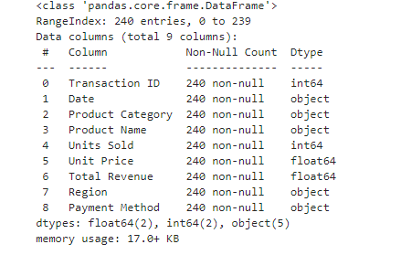
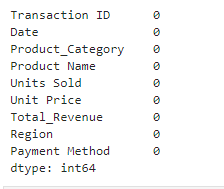
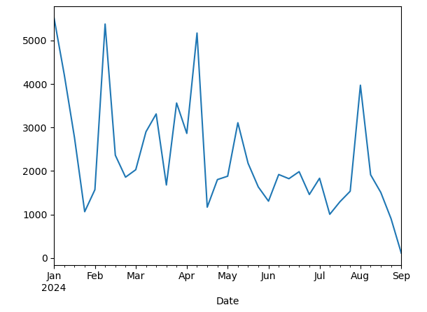
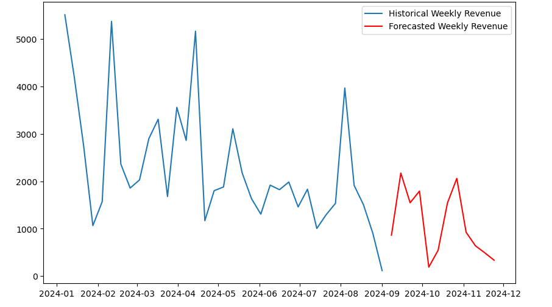
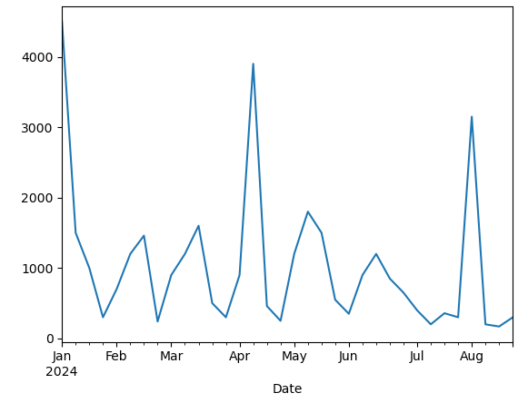
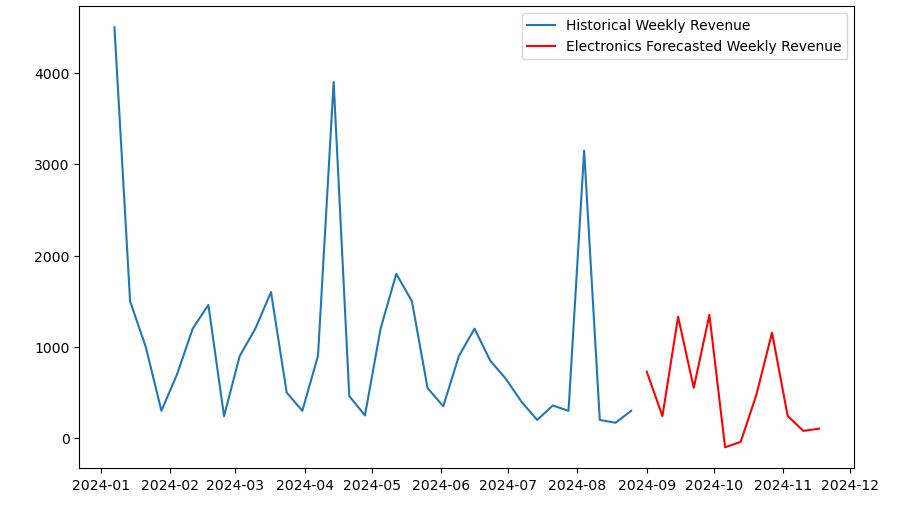
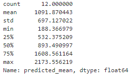
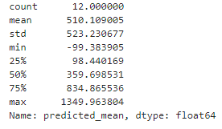

# Data Portfolio


# Table of Contents

- [Objective](#objective)
- [Data Source](#data-source)
- [Stages](#stages)
- [Development](#development)
  - [Pseudocode](#pseudocode)
  - [Data Exploration](#data_exploration)
  - [Data Cleaning](#data_cleaning)
  - [Transform the Data](#transform_the_data)
  - [Create the SQL View](#create_the_sql_view)
- [Testing](#testing)
   - [Data Quality Tests](#data_qualitytests)
- [Visualization](#visualization)
  - [Results](#results)
- [Analysis](#analysis)
  - [Findings](#findings)
  - [Models](#models)
  - [Discovery](#discovery)
- [Recommendation](#recommendation)
  - [Potential ROI]
  - [Potential Course of Actions]
- [Conclusion](#conclusion)


# Objective

- What is the purpose of this project?

An online sales company is looking to see what product category has done well during 2024 and how it improved during the year. They want to see what product category they should invest more money into. 

- What is the ideal solution?

I need to create a dashboard that displays insights on their best selling products on their website. This would include:
- Units Sold
- Unit Price
- Total Revenue

Using the information above will allow the marketing team to make data-driven decisions to invest.

## User Story

I am looking to create a dashboard that analyzes online store data during 2024.

The dashboard should display the best products in each category and how much revenue it generated based on the unit price and how many units were sold.

Using this data will allow the company to see what product will boost their revenue for the rest of the year


# Data Source

-What data will complete our objective?

We need data from their online sales for 2024 which includes
- Product Name
- Total Units
- Total Revenue

- Where can you find this data?
This data can we be sourced from Kaggle, [you can find it here](https://www.kaggle.com/datasets/shreyanshverma27/online-sales-dataset-popular-marketplace-data)

# Stages 

- Design
- Development
- Testing
- Analysis


# Design


## Dashboard Components required
- What should be included in the dashboard based on the requirements?

In order to answer this question, we need to know what questions the dashboard should answer:

1. How many product categories are contained in the data?
2. Which product categories has sold the most units?
3. Which product categories has generated the most revenue?
4. Within the top product category, which 3 products made the most revenue?
5. Which 3 products have the highest revenue to unit price ratio?

These questions are what we are asking ourselves and there will be more as we continue with our analysis. 


## Dashboard Mockup

- How should the dashboard look?

The data visuals that are suitable for our dashboard includes:

1. Scorecards
2. Table
3. Treemap
4. Circle graph

## Tools

| Tool | Purpose |
| --- | --- |
| Excel | Explore the data without filters |
| mySQL | Clean, test and analyze the data |
| Power BI | Visualize the data through interactive dashboards |
| Githib | Host the project documents and version control |

# Development

## Pseudocode

- What is the general approach to create a solution from start to finish?

1. Retrieve the data
2. Explore the data via Excel
3. Extract the data into SQL
4. Clean and filter the data using SQL
5. Test the data
6. Visualize the data using Power BI
7. Generate the findings based on the insights
8. Write the documentation
9. Publish the data to Github

## Data Exploration Notes

Here we see what is in the data such as errors, inconsistencies, bugs and corrupted characters etc.

- Based on seeing the data without cleaning it, what did you notice?

  1. The date is considered a "string", not a "date". Power BI will not utilize it for its purpose.
  2. The file has a space within its name and the space should be "_", this will cause complications in calling the file.
  3. There are 5 columns that contain the information we need to complete our objective.
  4. There appears to be more columns than we need. We will need to remove these columns

## Data Cleaning
- What should we expect the data to look like after cleaning? (What constraints should we add? What should it contain?)

We are looking to improve the dataset to make sure it is structured and it is ready to analyzed

The clean data criteria includes:

- Only use columns that are relevant to the objective
- All data types should be suited for the information included in the column
- There should be no null values and complete data throughout all the columns

The table below outlines the constraints on our cleaned dataset

| Property | Description |
| --- | --- |
| Number of Rows | 240 |
| Number of Columns | 6 |

This table is a tabular representation of the expected schema for clean data:

| Column Name| Data type | Nullable | 
| --- | --- | --- |
| Product Name | VARCHAR | NO |
| UNIT PRICE | INTEGER | NO |
| UNITS SOLD | INTEGER | NO |
| TOTAL REVENUE | INTEGER | NO |

- What are the steps to clean the data and filter it our desired format?

1. Remove unnecessary columns
2. Change Date format from "String" to "Date"
3. Rename columns if neccessary


### Transform the data

```sql

/*
 # 1. Select the required columns
 # 2. Modify the date column
*/
SELECT 
		CAST(Date as DATE) as Date,
		`Product Name`,
		`Product Category`,
		`Unit Price`,
		`Units Sold`,
		`Total Revenue`,
		`Region`
        
FROM online_sales_data

```

### Create the SQL View

```sql
/*
 # 1. Create a view to store the transformed data
 # 2. Cast the date from string to date
 # 3. Select the required columns from online_sales_data SQL Table
*/

-- 1.
 CREATE VIEW view_sales_data AS
 online_sales_data

-- 2. 
	SELECT 
		CAST(Date as DATE) as Date,
		`Product Name`,
		`Product Category`,
		`Unit Price`,
		`Units Sold`,
		`Total Revenue`,
		`Region`
        
-- 3.
FROM online_sales_data

```

# Testing

- What are qualities are we looking for when transforming the data?

Here are some quality tests conducted:

## Row Count Check 

```sql
/*
  Row count
*/
SELECT
 COUNT(*) AS row_count
FROM 
   online_sales_data

```


## Column Count Check
### SQL query

```sql

/*
	Column Count
*/

SELECT
	COUNT(*) AS column_count
FROM
	INFORMATION_SCHEMA.COLUMNS
WHERE
	TABLE_NAME = 'view_sales_data'
   
```
### Output


## Data Type Check
### SQL query

```sql

/*
# Check the data types of each column from the view by checking the INFORMATION SCHEMA view
*/

-- 1.
SELECT
    COLUMN_NAME,
    DATA_TYPE
FROM
    INFORMATION_SCHEMA.COLUMNS
WHERE
    TABLE_NAME = 'view_sales_data';
```
### Output


# Visualization

## Results

- What does the dashboard look like?


Displays the online sales of 2024 so far.

# Analysis

## Findings
- When you made the dashboard what did you notice?

When I made the dashboard I made an interactive line graph which demonstrated how the sales were during the time of
01/01/2024 - 08/31/2024. The graph was based on the Total Revenue as the y-axis and Date as the x-axis. During Februaryit was at a decline and it made a brief increase in sale for approximately a month and afterwards, it continued to decline.

- How can I predict the sales of the dataset?

I used Jupyter Notebook to extract the data and develop a model that is able to predict sales. Just as I used SQL to lean the data for the dashboard, I cleaned it and took the columns I needed to produce a model. I used libraries such as pandas, numpy, tensorflow, sklearn, etc. These libraries helped me develop a model that could predict what sales could be based on Units Sold and Total Revenue.

### These are the packages I used
```python
import pandas as pd
import numpy as np
from statsmodels.tsa.statespace.sarimax import SARIMAX
import matplotlib.pyplot as plt
```


### Extract the data from the CSV file and examine the data
``` python
df = pd.read_csv("Online Sales Data.csv")
df.info()
```



### Change the data type for column "Date" and change the name of the columns that will be used for the model
``` python

df['Date'] = pd.to_datetime(df['Date'])
df = df.rename(columns={"Total Revenue": "Total_Revenue"})
df = df.rename(columns={"Product Category": "Product_Category"})

```


### Check for null values
``` python

df.isnull().sum()

```



### Create a dataframe with the weekly sum of revenue and plot it 
``` python

weekly_revenue = df.groupby(pd.Grouper(key='Date',freq = 'W')).sum()['Total_Revenue']

weekly_revenue.plot()

```

## Model



### Fit the model 
``` python
model = SARIMAX(weekly_revenue, order=(1, 1, 1), seasonal_order=(1, 1, 1, 12))
# Fit the model
results = model.fit()
```


### Forecast the revenue for the year and plot it 
``` python

forecast = results.forecast(steps=12)

# Plot the historical data and forecast
plt.figure(figsize=(10, 6))
plt.plot(weekly_revenue.index, weekly_revenue, label='Historical weekly Revenue')
plt.plot(forecast.index, forecast, label='Forecasted weekly Revenue', color='red')
plt.legend()
plt.show()

```



### Create a dataframe with just Electronics category and plot it
``` Python

Elec_df = df[df['Product_Category'].eq('Electronics')]
e_weekly_revenue = Elec_df.groupby(pd.Grouper(key='Date',freq = 'W')).sum()['Total_Revenue']
e_weekly_revenue.plot()

```




### Fit the model and plot it to see how investing more into Electronics would improve sales
``` Python
model2 = SARIMAX(e_weekly_revenue, order=(1, 1, 1), seasonal_order=(1, 1, 1, 12))
results2 = model2.fit()
forecast2 = results2.forecast(steps=12)

# Plot the historical data and forecast
plt.figure(figsize=(10, 6))
plt.plot(e_weekly_revenue.index, e_weekly_revenue, label='Historical Weekly Revenue')
plt.plot(forecast2.index, forecast2, label='Electronics Forecasted Weekly Revenue', color='red')
plt.legend()
plt.show()

```




### Get the average weekly revenue forecast 
``` Python

# For all categories
forecast.describe()

```



``` Python

# For Electronics category
forecast2.describe()

```




